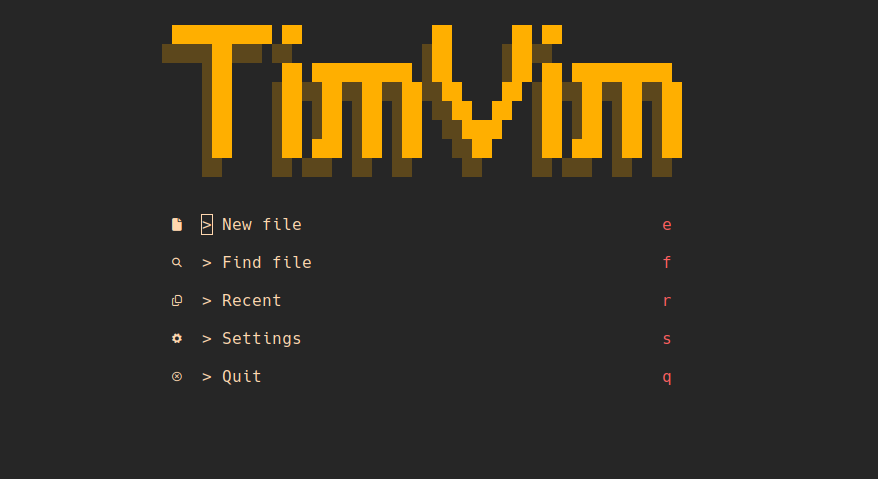

# NeoVim Configuration 
This is my NeoVim configuration. Feel free to snipe this if you would like.  



### Project specific settings
In your project folder you may add a .exrc file. Any configurations or 
settings added to this file will overrwrite existing settings in your init.vim.

### Configuring Debugger Adapter Protocol locally 

```
local dap = require("dap")

dap.configurations.rust = {
  {
    name = "Launch file",
    type = "codelldb",
    request = "launch",
    -- replace the path here 
    program = vim.fn.getcwd() .. '/path/to/your/target',
    cwd = '${workspaceFolder}',
    stopOnEntry = false,
  },
}
```

### TODO: 

[ ] Configure Python debugging   
[ ] Upgrade greeter  
[ ] Add some more notes how the setup is done  
[ ] Customize the lualine plugin with preffered colors for each mode  
[ ] Try bufferline   
[ ] Filetree maybe?  
[ ] Lazy loading where it makes sense   
[ ] Markdown previewer maybe?   

